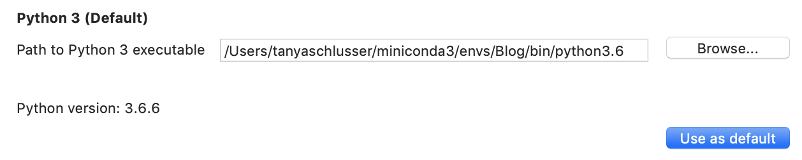
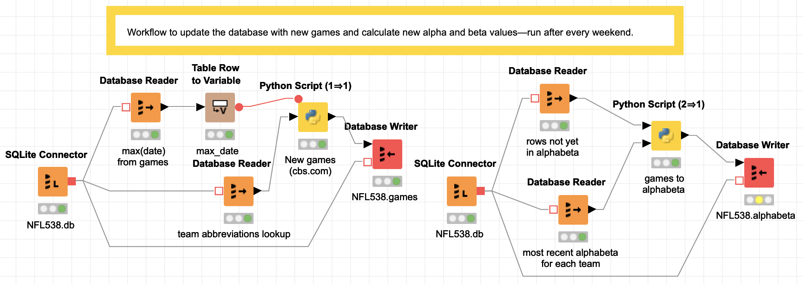

<!--
.. title: What's so great about Knime?
.. slug: whats-so-great-about-knime
.. date: 2019-01-08 00:00:42 UTC-05:00
.. tags: mathjax,data science,workflow,knime,python
.. category: Tools
.. link: 
.. description: 
.. type: text
-->

Last March, (for the fifth time, according to
[Forest Grove Technology](https://www.forestgt.com.au/latest-news/2018/3/2/knime-2018-gartner-magic-quadrant-market-leader)),
the [Knime Analytics platform](https://www.knime.com/) was named a Gartner Magic Quadrant
leader. This year's other leaders are [Alteryx](https://www.alteryx.com/),
[SAS](https://www.sas.com/), [RapidMinder](https://rapidminer.com/),
and [H2Oai](https://www.h2o.ai/).
The best thing I learned from the announcement? Knime is open source,
and free for individual users—I can afford to look at it!

Knime (silent "k"; rhymes with "dime") provides a graphical user interface
to chain together blocks that represent steps in a data science workflow.
(So they're like Pentaho or Informatica but for machine learning.
 Or [LabView](http://www.ni.com/en-us/shop/labview.html) if you have an
engineering background.)

It has dozens of built-in data access and transformation functions,
statistical inference and machine learning algorithms,
[PMML](https://sourceforge.net/projects/pmml/),
and custom <a href="https://www.knime.com/blog/blending-knime-and-python">Python</a>,
<a href="https://www.knime.com/nodeguide/scripting/java/example-of-java-snippet">Java</a>,
<a href="https://www.knime.com/nodeguide/scripting/r/example-of-r-snippet">R</a>,
<a href="https://informationentropy.wordpress.com/2016/03/24/programming-nodes-in-knime-with-scala-part-i/">Scala</a>,
a <a href="https://www.knime.com/nodeguide">zillion other nodes</a>,
or other community plugins (since it's open source, anyone can
<a href="https://www.knime.com/developer/example/extension-wizard">make a plugin</a>.)
Even better, Knime imposes structure and modularity
on a data science workflow by requiring code fit into specified building blocks.

This post implements the Bayesian NFL model from
<a href="https://tanyaschlusser.github.io/posts/bayesian-updating-and-the-nfl/">last month</a>
in Knime.
It adds the upstream and downstream workflows to pull new data each week and
write the model output to a spreadsheet: enough for a first look at this tool.

<!-- TEASER_END -->

## Knime's use case

Last year, Justin Gage posted a great 
<a href="http://justinsgage.com/blog/2017/09/13/machine-learning-abstraction-and-the-age-of-ai-ease">blog post (no https)</a>
praising new libraries that democratize Artificial Intelligence (AI) by
making it possible to generate models in three lines of code:

<blockquote>
"User diversity is good. It leads to better and more balanced product updates and timelines. Democratization can speed up the rate of AI progress and enable even better solutions down the road."
— Justin Gage
</blockquote>

But last month he criticized standalone Graphical User Interfaces (GUIs)
for machine learning. He argues that without upstream data collection and preparation
and downstream deployment, isolated machine learning tools can't add value.

<blockquote class="twitter-tweet" data-lang="en">
4/ The majority of a data scientist + data engineer + devops engineer time will be spent on getting data pipelines robust, cleaning said data, creative featurization and preprocessing, and deployment (which is a whole mess in of itself)
&mdash; Justin Gage (@jGage718) <a href="https://twitter.com/jGage718/status/1040324134633385985?ref_src=twsrc%5Etfw">September 13, 2018</a></blockquote>

Knime is the thing he wants! A GUI machine learning pipeline
tool—and the next step to fully democratize data science.  And yes, it can
<a href="https://www.knime.com/knime-big-data-connectors">even do big data</a>
</img>
</img>
</img>
</img>.

## Knime is a great solution for many workflow problems

</img>

A lot of my previous work has been
with domain-expert statisticians at Fortune 1000 companies. Most of them
are long time users of SAS, SPSS, or Stata—the traditional statistical analysis
tools taught before the mid-2000s when Python really began challenging R for
open source analytics market share.

These people often have doctorates in their specific field, and although expert
in their tool, not traditionally-trained coders. (They could
design pharmaceutical studies or be expert witnesses for insurance lawsuits—with a lifetime of domain specific training.)
In these large companies, dedicated teams of people (frequently consultants
like my former colleagues) are hired to:

- Plumb the data (make the pipelines),
- clean the data (hopefully *before* it enters the database),
- and deploy finished model output to a dashboard, report, or database.

If you have these kind of humans in your team, Knime is a good tool.
For non-coders, there are premade analytical blocks (see the list of directories in the inset image)
that have an input port for the table(s) you will use, and an output port to send the result
to a dashboard or other destination.
There's also extensive [PMML support](https://www.knime.com/blog/pmml-integration-in-knime),
so if your experts build complex models in another enterprise tool with PMML support,
they can export it for use in Knime.

And if you have a handful of coders who love using Python and others who
love R, they can develop in their preferred language and still interface well
with everyone else using Knime's building blocks.
Why? Because the blocks force users to build composable modules by imposing
variable names and types (like a Pandas `DataFrame`) for each block's
input and output ports.

#### Communication is king 👑

Bonus: any C-level person, even
if completely unfamiliar with data science, can visually follow the pictures
in the workflow and understand the gist of what their data science team is doing.
Even better, junior people can onboard quickly into a data science
team with workflows that have existing data preparation written by people
already familiar with the company's data
and target metrics.

#### A big company is a risky place for data cowfolks to roll their own features. 🤠 

The last thing a company needs is a data wild west.
A handful of in-house experts really ought to do (and document) all of the
creative featurization and preprocessing. Teams with foresight will involve C-level
people in the feature selection and make sure those features align with company
performance metrics. (For example, are we maximizing new subscribers or minimizing churn?
And the simple things matter: you don't want each person making different age range bins.)

With Knime enforcing modularity
via its user interface, it becomes easier to share parts of a workflow across projects
so that the less-expert but still very useful analysts can do their job knowing
they have sound inputs. But don't believe me, believe Paige Bailey:

<blockquote class="twitter-tweet" data-lang="en">
*drags box from off-screen* *stands on box*  Get obsessed with data lineage + provenance.  EVERY input feature that you use for your machine learning model should have an owner, documentation, descriptive names, and rules for quality-checking.  üôè  *steps off box, goes offscreen*
&mdash; 👩‍💻 .pb is for Paige Bailey ✨ (@DynamicWebPaige) <a href="https://twitter.com/DynamicWebPaige/status/1054084568444092416?ref_src=twsrc%5Etfw">October 21, 2018</a></blockquote>

#### Caveats

One negative is it took me 3 or 4 times as long to build this as it did to
create the command-line workflow I have used for the first third of the season.
(Hopefully part of that was learning Knime.)
But next year I can open this file and remember at a glance what I
was doing, since the entire workflow is in pictures.

Depending on the need, the benefits for communication and collaboration can outweigh
the intial distress of having to conform to the modular box framework Knime provides.
Other caveats:

- Some coders sometimes think GUIs are for babies and may quit in disgust if they're
  not sold on the benefit to the team.
- There is no built-in way to handle version control in Knime Analytics (free)
  - But you can do it in Knime Server (paid) as of version 3.8 (Currently on 4.7.3),
    and have granular permission setting on workflows.
  - You can also check entire Knime workflows into a git repo if you're
    cheap or flying solo:
    ([my example](https://github.com/tanyaschlusser/Knime-NFL-example), not recommended
    because the code is zipped so there are no diffs which is half the point of versioning.)

Go on, [download it](https://www.knime.com/downloads)—and follow along.
The workflow for this blog post is zipped in
[this file (NFL.knwf)](https://tanyaschlusser.github.io/posts/whats-so-great-about-knime/NFL.knwf).
You can move it to your Knime workflows directory (`~/knime-workflows` is my default)
or leave it where it is and navigate to it.

You will also have to set up your Python environment. Either use one that already
has `requests`, `numpy`, and `pandas` installed, or create a new one with this
[requirements.txt](https://tanyaschlusser.github.io/posts/whats-so-great-about-knime/requirements.txt):

- `conda create -n nfl-knime-example --file requirements.txt` ([get conda](https://conda.io/docs/user-guide/install/download.html))
- or 
  `mkvirtualenv nfl-knime-example -r requirements.txt` ([get mkvirtualenv](https://virtualenvwrapper.readthedocs.io/en/latest/install.html))

## Example with NFL predictions

The very first thing, since I'm using Python, is to set the path to my Conda
(or virtualenv) environment. 

Navigate to

<blockquote>
KNIME → Preferences → KNIME → Python
</blockquote>

And select the path for the Python executable in your desired environment.
If you want, also click
</img>.

</img>

### Objective

The following Knime workflows will start from scratch to load everything I need for
[the model from last month's post](https://tanyaschlusser.github.io/posts/bayesian-updating-and-the-nfl/):
counting the number of wins and losses and
predicting win likelihood for the home team $H$ versus the away team $A$ as:

$$
P(H \text{ will win}) = \frac{H_\text{wins} + A_\text{losses}}{H_\text{total games} + A_\text{total games}}
                 + \text{Home advantage}
$$

(Plus reversion to mean.) The three Knime workflows in this post are (1) Data ingestion,
(2) Data updating each week, and (3) Predictions for each week.

### Data ingestion

This first workflow is the initial data pull from the
<a href="https://github.com/fivethirtyeight/nfl-elo-game/raw/master/data/nfl_games.csv">FiveThirtyEight CSV</a>,
plus data I pulled to get the schedule for the upcoming 2018 season, and a lookup file
mapping the FiveThirtyEight team abbreviations to the team abbreviations from
[CBS.com](https://www.cbssports.com/nfl/scoreboard/all/2018/regular/7/),
where I will get the new data from every week.

The important thing here is, I wrote no code; I just selected
the SQL type (varchar/float) for columns in the red "Database Writer" nodes.
The very first node—the SQLite connector to <code>NFL538.db</code>—will create the database at the file location specified if one does not already exist.
 The last block—"Database Table Creator"—contains no data;
it sets up column names and types for a blank table that will hold
each team's Alpha/Beta values week over week for the Bayesian updating.

Every destination block in the workflow (the "Database Writer" and "Database Table Creator") blocks
must be executed separately. To execute, right click (or control-click) and select "Execute".

</img>

### Data updating

This second workflow is in two steps. Again the point is to show that you can follow
all of the sequence without seeing a single line of code.

#### Description of the steps

On the left is the weekly data pull from 
[CBS.com](https://www.cbssports.com/nfl/scoreboard/all/2018/regular/7/).
In the first step, there is a SQLite connector to open the football database NFL538.db,
then one block to read the most recent game date and another to read the entire team
abbreviation lookup table (because CBS and the FiveThirtyEight abbreviations are different).
The most recent date is fed into a transformer to convert the "table" into a "flow variable".
In Python all of the flow variables are values passed around in a dictionary.
The Python script then pulls all of the games that have been played between the last
database date and now.
The resulting new game data then flows into a final block that writes to the '`games`' table
in the NFL538 database.

 On the right is the code to update the `alphabeta` table. (All of the workflow on the right
can now be replaced by a trigger
in SQLite as of September 15, since
<a href="https://www.sqlite.org/windowfunctions.html#history">SQLite now supports window functions</a>,
but I started this blog post before the release, so sorry).

The second workflow also starts with a SQLite connector to the football database NFL538.db, which reads all of the game data that has not yet been added to the 'alphabeta' table (with the running totals) into one Pandas DataFrame, and then reads the most recent alpha and beta values for each team into a second Pandas DataFrame. Both are input to a Python script that calculates the alpha and beta values (running wins/losses plus a reversion to mean) and writes them to the table 'alphabeta' in NFL538.db.

</img>

### Prediction

The final workflow does the actual prediction. It contains a loop (with start and end designated by the blue blocks) that calculates the prediction for each upcoming game. Honestly, the loop was non-intuitive for me to implement, and I would in the future just use a Python script with the three inputs: the home advantage, the upcoming matchups, and the most recent alpha and beta values used in the prediction.

Here's a description of the workflow as it is, for what it's worth: Each week, after re-running the two data updating steps in the last section, this step will make predictions for the upcoming games. First, a short Python script (the yellow block named `this_week`) identifies what week in the season it is, feeding a SQL query that pulls the upcoming week's lineup. Then the loop combines the upcoming game data with the team statistics and a number for home team advantage, and saves all of the predictions to an Excel worksheet (the red block).

The cool thing here is that instead of writing to an Excel file, this output could be sent to a dashboard for consumption by the HiPPOs (Highest Paid Person's Opinion, coined by <a href="https://www.forbes.com/sites/bernardmarr/2017/10/26/data-driven-decision-making-beware-of-the-hippo-effect/#7601d7ba80f9">Avinash Kaushik</a>).
Knime's <a href="https://www.knime.com/reporting">reporting tools</a> use the open-source BIRT tool (<a href="">Basic Intelligence Reporting Tool</a>) which I think kind of makes ugly stuff (<a href="https://www.eclipse.org/birt/demos/#solution">demos</a>), but hey, it's free. And there are <a href="https://docs.knime.com/latest/tableau_integration_user_guide/index.html">connectors to Tableau</a> if you want something nicer.

</img>

## Conclusion

If you run a data science team where infrastructure is becoming a bottleneck, Knime may be worth a try:
your team can use the analytics tools they are familiar with (I actually like the Python IDE) and
you get reusable, modular code almost for free thanks to the way Knime is structured to pass data between nodes.
And, as of <a href="https://www.knime.com/about/news/knime-analytics-platform-37-is-now-available">December 2018</a>, you can <a href ="https://www.knime.com/nodeguide/scripting/python/embedding-documents-with-jupyter">use Jupyter notebooks in Knime</a>...happy coding!

P.S. the Knime Workflow in this post is [downloadable here](NFL.knwf).

### Python libraries used in this example

- The Knime Analytics version used in this example is 3.6.0.
- The SQLite3 database version is 3.24.0.
- The Conda environment in this example uses Python 3.6.6, NumPy 1.15.1, Pandas 0.23.4, requests 2.19.1, and lxml 4.2.4
- The [requirements.txt](https://tanyaschlusser.github.io/posts/whats-so-great-about-knime/requirements.txt)

### Vocabulary

- **Gartner Magic Quadrant** 
Gartner is a consulting and analysis company that puts out annual ["Magic Quadrant"](https://www.gartner.com/en/research/methodologies/magic-quadrants-research) assessments comparing industry leaders' technology. Those who make it in the "upper right" quadrant generally blog post and publicize it.

- **plumbing** 
It's probably not an official term, but a lot of my friends call extract, transform, load and other data engineering work "data plumbing". When I say it people outside the industry understand what I'm talking about.

- **PMML** 
The [Predictive Model Markup Language](https://sourceforge.net/projects/pmml/) is an industry standard XML format to specify common machine learning models with the intent to make them portable across implementations (SPSS/SAS/R/Python/etc).

- **SQL Trigger** 
A SQL 'trigger' is an action (such as a query and insert) that is run every time 'something' happens, where something in SQLite can be an insert, update, or delete.
([https://www.sqlite.org/lang_createtrigger.html](SQLite trigger documentation) — doesn't support <a href="https://www.sqlite.org/omitted.html"><code>FOR EACH ROW</code></a>)

### References

- [Blending Knime and Python](https://www.knime.com/blog/blending-knime-and-python)—Bidirectional use of Knime...also from Python using Knime web server which is just an HTTP GET
- [Announcement: Knime Server (3.8+; 2014) has version control](https://www.youtube.com/watch?v=XewYe39heAE)
- [Annoumcement: Knime (3.7+; 2018) works with Jupyter](https://www.knime.com/about/news/knime-analytics-platform-37-is-now-available)
- [Example embedding documents using a Jupyter notebook](https://www.knime.com/nodeguide/scripting/python/embedding-documents-with-jupyter)
- [Example using Java in Knime](https://www.knime.com/nodeguide/scripting/java/example-of-java-snippet)
- [Example using R in Knime](https://www.knime.com/nodeguide/scripting/r/example-of-r-snippet)
- [Example using Python in Knime](https://www.knime.com/blog/blending-knime-and-python)
- [Example using Scala in Knime](https://informationentropy.wordpress.com/2016/03/24/programming-nodes-in-knime-with-scala-part-i/)
- [Tons of other Knime nodes](https://www.knime.com/nodeguide)
- [The FiveThirtyEight NFL game data](https://github.com/fivethirtyeight/nfl-elo-game/raw/master/data/nfl_games.csv)
- [Knime big data connectors](https://www.knime.com/knime-big-data-connectors)
- ["The HiPPO effect"](https://www.forbes.com/sites/bernardmarr/2017/10/26/data-driven-decision-making-beware-of-the-hippo-effect/#7601d7ba80f9)
- [Knime's reporting tools](https://www.knime.com/reporting)
- [Description of BIRT (Basic Intelligence Reporting Tool)](https://www.eclipse.org/birt/)  ([demos](https://www.eclipse.org/birt/demos/#solution))
- [Knime Tableau integration guide](https://docs.knime.com/latest/tableau_integration_user_guide/index.html)
